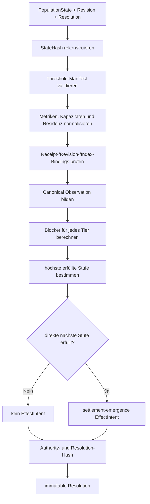

# AIM-548 — Deterministic Settlement Emergence

> **Status:** aktuelle Aurion-Implementierung auf `feat/548-settlement-emergence`, Commit `a5b41d962bf161bb41de6b260f2c7ffe7ece5efb`, Draft-PR [#655](https://github.com/OuroborosCollective/Echoes_of_Aurion/pull/655).
>
> **Authority:** Aurion. Renderer, UI, GLB/Mesh-Assets und externe Analysewerkzeuge sind keine Settlement-Authority.

## Ziel

Issue #548 implementiert Settlement-Emergence als reine, reproduzierbare Aurion-Resolution. Ein Settlement entsteht nicht durch ein sichtbares Mesh, eine Client-Behauptung oder einen `found_city`-Button, sondern nur durch bestätigte Population, dauerhafte Residenz, Ressourcen, Kapazität, Produktion, Sicherheit, Anbindung und Kohäsion.

Der Resolver liest kanonische Inputs, validiert deren Herkunft und erzeugt eine Entscheidung sowie optional genau eine `AurionEffectIntent`. Er schreibt keine Datenbankwahrheit und ruft keinen Provider direkt auf. Persistierung, Delivery und Readback verbleiben im bestehenden Effect-Intent-Journal.

## Implementierung

Dateien:

* `shared/aurionSettlementEmergenceProtocol.ts`
* `shared/aurionSettlementEmergenceProtocol.test.ts`

Protokoll:

```
aurion.settlement-emergence.v1
```

Kernfunktionen:

| Funktion                                                 | Vertrag                                                                              |
| -------------------------------------------------------- | ------------------------------------------------------------------------------------ |
| `resolveSettlementEmergence(input)`                      | validiert, normalisiert, evaluiert und erstellt höchstens eine Promotion-Intent      |
| `verifySettlementEmergenceResolution(input, resolution)` | rechnet die Resolution erneut und vergleicht Resolution-, Effect- und Payload-Hashes |

Der Population-State wird mit `createPopulationState` rekonstruiert. Stimmen rekonstruiertes und geliefertes `stateHash` nicht überein, schlägt die Resolution mit `SETTLEMENT_POPULATION_STATE_HASH_MISMATCH` fehl.

## Hierarchie und Promotionsregel

```
temporary_camp → homestead → hamlet → village → town → city
```

Die Hierarchie ist ein Runtime-Vertrag, nicht nur eine UI-Reihenfolge. Der Resolver evaluiert die höchste vollständig erfüllte Stufe, befördert aber pro Resolution ausschließlich in die direkt nächste Stufe. Ein neu geformtes Settlement beginnt deshalb als `temporary_camp`, selbst wenn bereits alle City-Gates erfüllt wären. Ein bestätigtes `town` kann direkt zu `city` aufsteigen, aber keine Stufe überspringen.

Eine bestätigte Stufe wird bei späterem Entzug einer Bedingung nicht automatisch demotiert. Stattdessen liefert die Resolution `currentTierSatisfied = false`, strukturierte Blocker und keinen Wachstums-Effect. Demotion bleibt ein separater, explizit zu definierender Vertrag.

## Eingabe- und Evidence-Vertrag

### Population und Residenz

`populationState` liefert Welt, Region, `resolutionIndex`, lebende Personen, Haushalte, Shelter-Kapazität und `stateHash`. Der State-Index muss exakt zum Auflösungsindex passen.

`residencyEvidence` enthält sortierte und eindeutige `residentIds`, `stableSinceResolutionIndex` sowie Receipt-, Revision- und Resolution-Bindings. Jede stabile Person muss lebend im Population-State existieren. Die Dauer wird ohne Rundung berechnet:

```
stableResidencyResolutions =
  resolutionIndex - stableSinceResolutionIndex
```

Unbekannte oder doppelte Personen und zukünftige Startpunkte werden fail-closed verworfen.

### Metriken

Es müssen genau sechs Metriken vorliegen. Jede trägt `sourceReceiptId`, `sourceReceiptHash`, `sourceRevision` und `resolutionIndex`:

| Metrik             |        Einheit |
| ------------------ | -------------: |
| `food_access`      | BPS `0..10000` |
| `water_access`     | BPS `0..10000` |
| `local_production` | BPS `0..10000` |
| `safety`           | BPS `0..10000` |
| `connectivity`     | BPS `0..10000` |
| `cohesion`         | BPS `0..10000` |

Doppelte, fehlende, unbekannte, außerhalb des BPS-Bereichs liegende oder revisionsfremde Evidence wird abgewiesen.

### Kapazitäten

Es müssen genau zwei nicht-negative Ganzzahlen vorliegen:

* `shelter`
* `storage`

Kapazität ist bestätigte Welt-Evidence. Meshes, Assets und Visual-Structure-IDs können sie nicht erzeugen.

### Bestehendes Settlement

`existingSettlement` ist `null` oder eine receipt-/revision-gebundene Stufe der festen Hierarchie. Diese Evidence wird in die Authority- und Resolution-Hashes aufgenommen.

## Threshold-Manifest

Das Manifest besitzt eine 40-stellige Hex-Revision und genau eine Threshold-Definition pro Tier. Jeder Tier beschreibt:

* Population und stabile Residenten;
* stabile Aufenthaltsdauer in Resolutions;
* Food-/Water-Access;
* Shelter-/Storage-Kapazität;
* lokale Produktion;
* Safety, Connectivity und Cohesion.

Vor der Auswertung gelten harte Invarianten:

1. exakt sechs eindeutige Tiers;
2. Population-Minima streng steigend;
3. alle übrigen Gates monoton nicht fallend;
4. `minStableResidents <= minPopulation`;
5. `minShelterCapacity >= minPopulation`;
6. BPS und Zähler als sichere, nicht-negative Ganzzahlen.

Der Regression-Contract verwendet folgende Referenzwerte:

| Tier             | Population | Stable residents | Stable resolutions | Food/Water | Shelter | Storage | Production | Safety | Connectivity/Cohesion |
| ---------------- | ---------: | ---------------: | -----------------: | ---------: | ------: | ------: | ---------: | -----: | --------------------: |
| `temporary_camp` |          1 |                1 |                  0 |       5000 |       1 |       1 |       1000 |   2000 |                  1000 |
| `homestead`      |          4 |                3 |                  1 |       6000 |       4 |       4 |       2000 |   3000 |                  2000 |
| `hamlet`         |         12 |                8 |                  2 |       7000 |      12 |      12 |       3500 |   4500 |                  3500 |
| `village`        |         40 |               28 |                  4 |       7500 |      48 |      64 |       5000 |   5500 |                  5000 |
| `town`           |        180 |              120 |                  8 |       8000 |     240 |     512 |       6500 |   6500 |                  6500 |
| `city`           |        800 |              560 |                 16 |       8500 |    1000 |    4000 |       8000 |   8000 |                  8000 |

## Deterministischer Ablauf



`blockersFor` vergleicht alle Gates und liefert jeweils `code`, `actual` und `required`. Codes umfassen `POPULATION_INSUFFICIENT`, `STABLE_RESIDENTS_INSUFFICIENT`, `STABLE_RESIDENCY_INSUFFICIENT`, `FOOD_ACCESS_INSUFFICIENT`, `WATER_ACCESS_INSUFFICIENT`, `SHELTER_CAPACITY_INSUFFICIENT`, `STORAGE_CAPACITY_INSUFFICIENT`, `LOCAL_PRODUCTION_INSUFFICIENT`, `SAFETY_INSUFFICIENT`, `CONNECTIVITY_INSUFFICIENT` und `COHESION_INSUFFICIENT`.

## Effect-Intent-Grenze

Bei einer gültigen direkten Promotion wird der bestehende Effect-Intent-Vertrag verwendet:

```
effectType = "settlement-emergence"
subjectId  = "settlement:<worldId>:<regionId>"
ordinal    = resolutionIndex
```

Das Payload bindet Protokoll, `fromTier`, `toTier`, `sourceRevision`, `populationStateHash`, `thresholdManifestHash` und `evidenceHash`. Daraus entstehen stabile `effectId` und `payloadHash`. Es gibt keinen Provider-Aufruf, keine irreversible Außenwirkung und keine direkte Datenbankmutation im Resolver.

## Hash- und Replay-Vertrag

Die Resolution bindet:

| Hash                    | Inhalt                                                                       |
| ----------------------- | ---------------------------------------------------------------------------- |
| `populationStateHash`   | kanonischer Population-State                                                 |
| `thresholdManifestHash` | Protokoll, Manifest-Revision und Thresholds                                  |
| `evidenceHash`          | kanonisch geordnete Metrik-, Kapazitäts-, Residency- und Settlement-Evidence |
| `authorityReceiptHash`  | Welt/Region, Revision, Index und vorgelagerte Hashes                         |
| `resolutionHash`        | vollständiges Ergebnis einschließlich Blocker und Effect-Intent-Identität    |

`verifySettlementEmergenceResolution` führt die Berechnung erneut aus. Eine manipulierte Resolution wird nur dann akzeptiert, wenn sämtliche relevanten Hashes wieder identisch sind.

## Fail-Closed und Authority Boundary

Abgewiesen werden unter anderem:

* gefälschte Population-Hashes;
* fehlende oder doppelte Evidence;
* fremde oder stale Revisionen;
* falsche Resolution-Indizes;
* nicht-strikte Population-Thresholds;
* fallende Gate-Thresholds;
* ungültige Resident-IDs;
* BPS außerhalb `0..10000`.

Normalisierte Ergebnisse werden mit `Object.freeze` unveränderbar gemacht. Es gibt keine Zufallsquelle, keine Zeitabfrage und kein implizites Runden.

Kanonisch sind Aurion Population-State, receipt-gebundene Evidence, versionierte Thresholds und der bestehende Effect-Intent-Vertrag. Nicht autoritativ sind Renderer, UI, GLB/Mesh, Visual-Structure-IDs, Client-Commands und Effect-Delivery-Status. Wolfram prüft die Arithmetik, besitzt aber keine Runtime-Wahrheit.

## Tests und Verifikation

Die dedizierte Suite deckt ab:

1. Formation erzeugt genau ein `temporary_camp`-Intent und überspringt keine Stufe.
2. Umgekehrte Input-Reihenfolge erzeugt exakt dieselbe Resolution; `town` wird zu `city` befördert.
3. Food-Access `7499` blockiert den City-Threshold `8000`; es wird kein Wachstums-Intent erzeugt.
4. Gefälschter Population-Hash, doppelte Metrik, fremde Revision und nicht-monotones Manifest schlagen fehl.

Nachweis des Draft-PRs:

```
pnpm vitest run shared/aurionSettlementEmergenceProtocol.test.ts
# 4 Tests bestanden
pnpm check
# TypeScript noEmit bestanden
pnpm build
# erfolgreich
pnpm test
# 357 Testdateien / 1.742 Tests bestanden
# 51 Testdateien / 192 Tests übersprungen: bestehende Umgebungs-Gates
```

Zusätzlich bestanden die angrenzenden Emergent-Life-, Need- und Population-Verträge mit 25 Tests, `git diff --check`, Serena-Diagnostik und der Determinismus-Scan ohne `Math.random`, `Date.now`, Mock oder Stub in den Issue-Dateien.

## Wolfram-Prüfung

Die Threshold-Arithmetik wurde als exakte Ganzzahlprüfung verifiziert:

* alle Threshold-Vektoren sind nicht fallend;
* Population-Minima sind strikt steigend;
* die City-Referenz erfüllt alle Gates exakt an ihrer Grenze;
* Food-Access `8499 < 8500` blockiert City;
* keine Floating-Point-Rundung ist beteiligt.

Wolfram ist Prüfwerkzeug, nicht Runtime-Authority.

## Bewusste Nicht-Zuständigkeiten

Issue #548 enthält keine neue Datenbankmigration, keine zweite Settlement-Authority, keine direkte Effect-Delivery, keine Renderer-/GLB-Produktion und keine automatische Demotion. Der Resolver entscheidet aufgrund von Evidence; der etablierte Aurion-Effect-/Receipt-/Persistence-Pfad materialisiert und liest die Entscheidung zurück.

## Quellen

* [Issue #548](https://github.com/OuroborosCollective/Echoes_of_Aurion/issues/548)
* [Draft-PR #655](https://github.com/OuroborosCollective/Echoes_of_Aurion/pull/655)
* [Resolver](https://github.com/OuroborosCollective/Echoes_of_Aurion/blob/feat/548-settlement-emergence/shared/aurionSettlementEmergenceProtocol.ts)
* [Regression-Suite](https://github.com/OuroborosCollective/Echoes_of_Aurion/blob/feat/548-settlement-emergence/shared/aurionSettlementEmergenceProtocol.test.ts)
* Effect Intent Journal
* Aurion Single Authority
