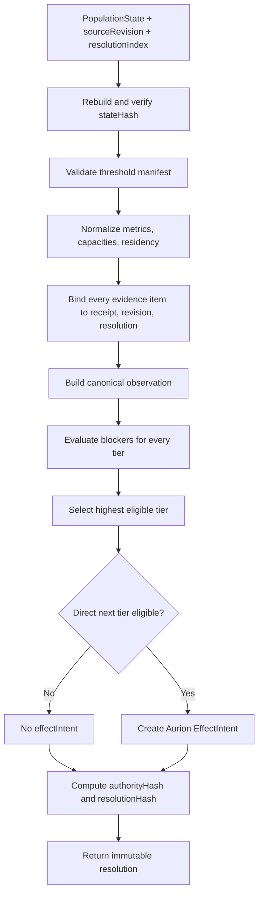

# AIM-548 — Deterministic Settlement Emergence

> **Status:** aktuelle Aurion-Implementierung auf `feat/548-settlement-emergence`, Commit `a5b41d962bf161bb41de6b260f2c7ffe7ece5efb`, Draft-PR [#655](https://github.com/OuroborosCollective/Echoes_of_Aurion/pull/655).
>
> **Authority:** Aurion. Diese Seite beschreibt aktuelle Code- und Testverträge, keine historische Provenienz und keine Renderer- oder Designannahme.

## 1. Zweck und Problemdefinition

Issue #548 schließt die Lücke zwischen bestätigter Weltentwicklung und Settlement-Emergence. Ein Settlement darf nicht entstehen, weil ein Client ein Mesh, eine Stadtmauer oder einen Button anzeigt. Es entsteht ausschließlich, wenn die kanonische Aurion-Wahrheit die dafür notwendigen Bedingungen erfüllt.

Der Resolver ist deshalb eine **reine Deterministik-Schicht**:

- Er liest einen verifizierten `PopulationState`.
- Er akzeptiert nur revisions- und receipt-gebundene Evidence.
- Er vergleicht exact integer thresholds ohne Floating-Point-Rundung.
- Er berechnet eine Entscheidung und optional genau eine `AurionEffectIntent`.
- Er schreibt selbst keine Datenbankwahrheit und führt keinen externen Effekt direkt aus.

Die Persistierung, Delivery und Readback eines erzeugten Effect Intents bleiben im bestehenden Aurion-Effect-Intent-Vertrag und dessen nachgelagerter Gateway-/Journal-Kette.

## 2. Implementierungsoberfläche

Die Implementierung liegt in:

- `shared/aurionSettlementEmergenceProtocol.ts`
- `shared/aurionSettlementEmergenceProtocol.test.ts`

Protokollkennung:

```text
aurion.settlement-emergence.v1
```

Öffentliche Kernfunktionen:

| Funktion | Zweck |
| --- | --- |
| `resolveSettlementEmergence(input)` | Normalisiert Inputs, validiert Authority-Bindings, evaluiert die höchste erfüllte Stufe und erzeugt höchstens eine Promotion-Intent. |
| `verifySettlementEmergenceResolution(input, resolution)` | Berechnet die Resolution erneut und akzeptiert sie nur bei identischem Resolution-/Effect-Intent-Hash. |

Die Funktion `createPopulationState` wird verwendet, um den Population-State kanonisch neu zu bilden. Der übergebene `stateHash` muss exakt dem rekonstruierten Hash entsprechen; ein manipulierter Snapshot wird mit `SETTLEMENT_POPULATION_STATE_HASH_MISMATCH` abgewiesen.

## 3. Settlement-Hierarchie

Die Reihenfolge ist im Protokoll unveränderlich definiert:

```text
temporary_camp → homestead → hamlet → village → town → city
```

Die Reihenfolge ist nicht bloß UI-Sortierung. Sie ist die deterministische Aufstiegsordnung. Der Resolver:

1. bestimmt die höchste Stufe, deren gesamte Threshold-Menge erfüllt ist;
2. liest die bereits bestätigte Stufe aus `existingSettlement`;
3. betrachtet nur die **direkt nächste** Stufe als Promotion-Kandidat;
4. erzeugt nie einen Sprung über mehrere Stufen in einer Resolution.

Ein neu geformtes Settlement geht daher zunächst auf `temporary_camp`, auch wenn alle späteren Thresholds bereits erfüllt sind. Ein bestätigtes `town` kann in derselben Resolution nur zu `city` aufsteigen.

Eine bereits bestätigte Stufe wird bei einer später entzogenen Bedingung nicht automatisch herabgestuft. Stattdessen wird `currentTierSatisfied = false`, der Blocker wird ausgegeben und es wird kein Wachstums-Effect erzeugt. Demotion ist ein eigener, nicht implizit erfundener Vertrag.

## 4. Eingabevertrag und Evidence-Bindings

### 4.1 Kanonischer Population-State

`populationState` liefert:

- `worldId` und `regionId`;
- `resolutionIndex`;
- aktive Person-IDs;
- Haushalte und Shelter-Kapazität;
- kanonische `stateHash`-Identität.

Der Resolver fordert `populationState.resolutionIndex === input.resolutionIndex`. Dadurch kann ein veralteter oder zeitlich verschobener Population-State nicht als aktuelle Settlement-Evidence verwendet werden.

### 4.2 Metrik-Evidence

Es müssen genau diese sechs Metriken vorhanden sein:

| Metrik | Einheit | Bedeutung |
| --- | ---: | --- |
| `food_access` | BPS `0..10000` | bestätigter Nahrungszugang |
| `water_access` | BPS `0..10000` | bestätigter Wasserzugang |
| `local_production` | BPS `0..10000` | lokale Produktionsfähigkeit |
| `safety` | BPS `0..10000` | bestätigte Sicherheit |
| `connectivity` | BPS `0..10000` | infrastrukturelle/regionale Anbindung |
| `cohesion` | BPS `0..10000` | soziale Stabilität und Zusammenhalt |

Jede Metrik enthält `sourceReceiptId`, `sourceReceiptHash`, `sourceRevision` und `resolutionIndex`. Die Eingabe wird nach einer festen Protokollreihenfolge normalisiert. Doppelte, fehlende, unbekannte, außerhalb `0..10000` liegende oder revisionsfremde Werte werden fail-closed abgewiesen.

### 4.3 Kapazitäts-Evidence

Es müssen genau zwei Kapazitäten vorhanden sein:

| Kapazität | Einheit | Bedeutung |
| --- | ---: | --- |
| `shelter` | nicht-negative Ganzzahl | bestätigte Unterkunftskapazität |
| `storage` | nicht-negative Ganzzahl | bestätigte Lager-/Versorgungskapazität |

Kapazitäten sind keine visuellen Eigenschaften. Ein Mesh, eine Asset-ID oder eine clientseitige Struktur kann diese Werte nicht erzeugen.

### 4.4 Dauerhafte Residenz

`residencyEvidence` enthält:

- sortierte, eindeutige `residentIds`;
- `stableSinceResolutionIndex`;
- Receipt-, Revision- und Resolution-Binding.

Alle stabilen Residenten müssen in `populationState.alivePersonIds` enthalten sein. Die stabile Dauer wird exakt berechnet:

```text
stableResidencyResolutions =
  resolutionIndex - stableSinceResolutionIndex
```

Negative oder zeitlich zukünftige Startpunkte, unbekannte Personen und doppelte Resident-IDs werden zurückgewiesen.

### 4.5 Bestehendes Settlement

`existingSettlement` ist entweder `null` oder eine receipt-/revision-gebundene bestätigte Stufe. Die Stufe muss aus der kanonischen Hierarchie stammen. Ihre Receipt-Evidence wird in den Authority- und Resolution-Hash aufgenommen.

## 5. Threshold-Manifest

Thresholds sind Runtime-Input und werden über eine 40-stellige Hex-`revision` versioniert. Das Manifest muss genau eine Definition für jede der sechs Stufen enthalten.

Jede `SettlementTierThreshold` definiert:

- `minPopulation`;
- `minStableResidents`;
- `minStableResidencyResolutions`;
- `minFoodAccessBps` und `minWaterAccessBps`;
- `minShelterCapacity` und `minStorageCapacity`;
- `minLocalProductionBps`;
- `minSafetyBps`;
- `minConnectivityBps`;
- `minCohesionBps`.

### 5.1 Strukturinvarianten

Der Resolver prüft vor jeder Auswertung:

1. Die Threshold-Liste enthält exakt sechs Stufen.
2. Jede Stufe ist eindeutig und gehört zur festen Hierarchie.
3. `minPopulation` steigt von Stufe zu Stufe **streng** an.
4. Alle übrigen Thresholds sind monoton nicht fallend.
5. `minStableResidents <= minPopulation`.
6. `minShelterCapacity >= minPopulation`.
7. Alle BPS-Werte sind sichere Ganzzahlen in `0..10000`.
8. Alle Zähler und Resolution-Indizes sind sichere, nicht-negative Ganzzahlen.

Damit kann ein fehlerhaftes oder inhaltlich rückwärts gerichtetes Manifest nicht stillschweigend eine frühere Stufe entwerten oder einen späteren Rang billiger machen.

### 5.2 Referenzschwellen aus dem Regression Contract

Die Regression-Suite verwendet folgende normativen Referenzwerte:

| Stufe | Population | stabile Residenten | stabile Resolutions | Food/Water | Shelter | Storage | Production | Safety | Connectivity/Cohesion |
| --- | ---: | ---: | ---: | ---: | ---: | ---: | ---: | ---: | ---: |
| `temporary_camp` | 1 | 1 | 0 | 5000 | 1 | 1 | 1000 | 2000 | 1000 |
| `homestead` | 4 | 3 | 1 | 6000 | 4 | 4 | 2000 | 3000 | 2000 |
| `hamlet` | 12 | 8 | 2 | 7000 | 12 | 12 | 3500 | 4500 | 3500 |
| `village` | 40 | 28 | 4 | 7500 | 48 | 64 | 5000 | 5500 | 5000 |
| `town` | 180 | 120 | 8 | 8000 | 240 | 512 | 6500 | 6500 | 6500 |
| `city` | 800 | 560 | 16 | 8500 | 1000 | 4000 | 8000 | 8000 | 8000 |

Diese Werte sind im Test als explizites Contract-Fixture dokumentiert. Änderungen an Produktionsmanifesten müssen eine neue Revision und entsprechende Evidence-/Balancing-Prüfung erhalten.

## 6. Deterministischer Ablauf



### 6.1 Blocker-Auswertung

`blockersFor` vergleicht jede tatsächliche Beobachtung mit der Threshold-Anforderung. Jede Unterschreitung wird als strukturierter Blocker mit `code`, `actual` und `required` zurückgegeben.

Mögliche Codes:

```text
POPULATION_INSUFFICIENT
STABLE_RESIDENTS_INSUFFICIENT
STABLE_RESIDENCY_INSUFFICIENT
FOOD_ACCESS_INSUFFICIENT
WATER_ACCESS_INSUFFICIENT
SHELTER_CAPACITY_INSUFFICIENT
STORAGE_CAPACITY_INSUFFICIENT
LOCAL_PRODUCTION_INSUFFICIENT
SAFETY_INSUFFICIENT
CONNECTIVITY_INSUFFICIENT
COHESION_INSUFFICIENT
```

Die Result-Struktur enthält sowohl `currentTierBlockers` als auch `nextTierBlockers`. Damit kann ein Readmodel erklären, warum ein Settlement aktuell nicht erfüllt ist und welche konkrete Voraussetzung für den nächsten Aufstieg fehlt.

### 6.2 Effect-Intent-Erzeugung

Nur wenn der direkte nächste Rang vollständig erfüllt ist, wird ein Intent erzeugt:

```text
effectType = "settlement-emergence"
subjectId  = "settlement:<worldId>:<regionId>"
ordinal    = resolutionIndex
```

Das Payload bindet mindestens:

- Protokollversion;
- `fromTier` und `toTier`;
- `sourceRevision`;
- `populationStateHash`;
- `thresholdManifestHash`;
- `evidenceHash`.

Der bestehende Effect-Intent-Vertrag berechnet daraus eine stabile `effectId` und einen separaten `payloadHash`. Der Resolver führt keinen Provider-Aufruf, keine irreversible Außenwirkung und keine direkte Datenbankmutation aus.

## 7. Hash- und Replay-Vertrag

Die Resolution bindet mehrere Identitäten:

| Hash | Inhalt |
| --- | --- |
| `populationStateHash` | verifizierter kanonischer Population-State |
| `thresholdManifestHash` | Protokoll, Manifest-Revision und normalisierte Thresholds |
| `evidenceHash` | sortierte Metrik-, Kapazitäts-, Residency- und Existing-Settlement-Evidence |
| `authorityReceiptHash` | Welt/Region, Revision, Resolution, State-, Manifest- und Evidence-Hashes |
| `resolutionHash` | vollständiges Ergebnis einschließlich Blockern und Effect-Intent-Identität |

`verifySettlementEmergenceResolution` ruft den Resolver erneut auf. Die Verifikation ist nur erfolgreich, wenn `resolutionHash`, `effectId` und `payloadHash` mit dem erneut berechneten Ergebnis übereinstimmen. Ein manipuliertes Ergebnis wird daher nicht durch ein separat eingereichtes Flag akzeptiert.

## 8. Authority Boundary

### Erlaubt und kanonisch

- Aurion `PopulationState`;
- bestätigte, receipt-gebundene Metriken;
- bestätigte Shelter-/Storage-Kapazität;
- bestätigte stabile Residenz;
- revisionsgebundene Threshold-Manifeste;
- bestehender Aurion Effect-Intent-Vertrag.

### Nicht autoritativ

- Renderer-Frames und UI-Zustand;
- GLB-, Mesh- oder Visual-Structure-IDs;
- clientseitige `found_city`-/`build_city`-Behauptungen;
- externe LLM-/CAG-/Wolfram-Ergebnisse als direkte Runtime-Wahrheit;
- Delivery-State eines Effects als Gameplay-State.

Wolfram dient in dieser Implementierung als Verifikationsinstrument für die arithmetischen Invarianten. Es besitzt keine Runtime-Authority. Ebenso erzeugt ein Visual keine Fähigkeit; Visualisierung ist eine Projektion bestätigter Aurion-Wahrheit.

## 9. Sicherheits- und Fail-Closed-Verhalten

Die Implementierung lehnt unter anderem ab:

| Fehlerklasse | Ergebnis |
| --- | --- |
| manipulierte Population-Hash | `SETTLEMENT_POPULATION_STATE_HASH_MISMATCH` |
| fehlende/falsche Manifest-Version | Manifest-Revision-Fehler |
| Threshold-Liste mit falscher Anzahl | `SETTLEMENT_THRESHOLD_TIER_COUNT_INVALID` |
| doppelte Stufe oder Evidence | Duplicate-Fehler |
| nicht-strikte Population-Reihenfolge | `SETTLEMENT_THRESHOLD_POPULATION_NOT_STRICT` |
| fallende Gate-Anforderung | `SETTLEMENT_THRESHOLD_NOT_MONOTONE` |
| stale/fremde Receipt-Revision | `SETTLEMENT_EVIDENCE_REVISION_MISMATCH` |
| falscher Resolution-Index | `SETTLEMENT_EVIDENCE_RESOLUTION_INDEX_MISMATCH` |
| unbekannter oder doppelter stabiler Resident | Resident-Fehler |
| BPS außerhalb `0..10000` | `SETTLEMENT_METRIC_BPS_INVALID` |

Alle normalisierten Ergebnisobjekte werden eingefroren (`Object.freeze`). Es gibt keine zufällige Auswahl, keine Zeitabfrage, kein implizites Runden und keine sichtbare Abkürzung um fehlende Evidence.

## 10. Regression- und Verifikationsnachweis

Die dedizierte Suite `shared/aurionSettlementEmergenceProtocol.test.ts` deckt vier Kernfälle ab:

1. **Formation:** Bei erfüllten City-Bedingungen wird dennoch genau ein `temporary_camp`-Intent erzeugt; die Hierarchie wird nicht übersprungen.
2. **Replay und Reihenfolge:** Reversierte Metrik-, Kapazitäts- und Resident-Inputs erzeugen exakt dieselbe Resolution; eine bestehende `town`-Stufe wird zu `city` befördert.
3. **Entzug:** Food-Access `7499` blockiert eine Village-Resolution gegen den City-Threshold `8000`; es entsteht kein Wachstums-Intent und keine visuelle Kapazität.
4. **Fail-closed:** Gefälschter Population-Hash, doppelte Metrik, fremde Revision und nicht-monotones Manifest werden abgewiesen.

Ausgeführte Validierung des Draft-PRs:

```text
pnpm vitest run shared/aurionSettlementEmergenceProtocol.test.ts
# 4 Tests bestanden

pnpm check
# TypeScript noEmit bestanden

pnpm build
# erfolgreich

pnpm test
# 357 Testdateien bestanden
# 1.742 Tests bestanden
# 51 Testdateien / 192 Tests übersprungen (bestehende Umgebungs-Gates)
```

Zusätzlich bestanden:

- Nachbarverträge für Emergent Life, Need Dynamics und Population Dynamics: 25 Tests;
- `git diff --check`;
- Serena-Diagnostik ohne Fehler;
- Determinismus-Scan ohne `Math.random`, `Date.now`, TODO, Mock oder Stub in den Issue-Dateien.

## 11. Wolfram-Verifikation

Die arithmetische Prüfung wurde mit exakten Ganzzahlen formuliert:

- alle Threshold-Vektoren sind nicht fallend;
- Population-Minima sind strikt steigend;
- die City-Referenz erfüllt alle Thresholds exakt an der Grenze;
- Food-Access `8499` liegt unter `8500` und blockiert die City-Bedingung;
- es gibt keine Rundungsregel und keine Floating-Point-Abhängigkeit.

Wolfram ist damit ein reproduzierbares Prüfprotokoll für die Schwellenlogik, nicht der Owner des Settlement-Zustands.

## 12. Bewusste Nicht-Zuständigkeiten

Issue #548 implementiert den Resolver und seinen deterministischen Effect-Intent-Ausgang. Nicht enthalten sind:

- neue Datenbankmigrationen;
- eine neue Settlement-Persistenz-Authority;
- direkte Effect-Delivery;
- Renderer- oder GLB-Produktion;
- automatische Demotion;
- ein Client-Command, das Thresholds umgehen kann.

Diese Trennung ist beabsichtigt: Settlement-Emergence entscheidet aufgrund von Evidence; der vorhandene Aurion-Effect-/Receipt-/Persistence-Pfad materialisiert und liest die Entscheidung anschließend deterministisch zurück.

## 13. Quellen und Nachvollziehbarkeit

- [Issue #548](https://github.com/OuroborosCollective/Echoes_of_Aurion/issues/548)
- [Draft-PR #655](https://github.com/OuroborosCollective/Echoes_of_Aurion/pull/655)
- [Resolver-Implementierung](https://github.com/OuroborosCollective/Echoes_of_Aurion/blob/feat/548-settlement-emergence/shared/aurionSettlementEmergenceProtocol.ts)
- [Regression-Suite](https://github.com/OuroborosCollective/Echoes_of_Aurion/blob/feat/548-settlement-emergence/shared/aurionSettlementEmergenceProtocol.test.ts)
- [Effect Intent Journal](./aurion-effect-intent-journal.md)
- [Aurion Single Authority](../ARCHITECTURE_OWNERSHIP.md)
