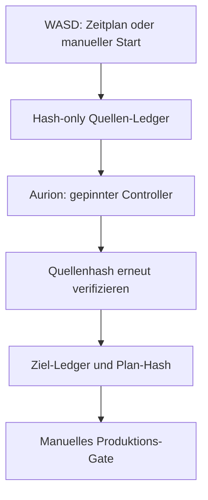
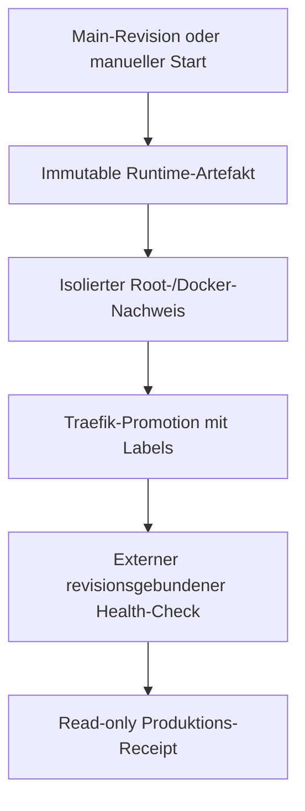

# Aurion ↔ WASD Automatisierungs-Runbook

Dieses Runbook beschreibt die produktive Automatisierung zwischen
`OuroborosCollective/Wasd` und `OuroborosCollective/Echoes_of_Aurion`.
Sie erstellt nachvollziehbare Quellen-, Ziel- und Migrationsnachweise,
promotet die Aurion-Laufzeit über Traefik und stellt einen **getrennten,
eng begrenzten** Apply-Pfad für die sieben inventarisierten Schema-Migrationen
bereit. Der Ledger selbst führt weiterhin keine Produktionsschreiboperation
aus.

## Leitprinzipien

- Jeder Nachweis ist an eine konkrete 40-stellige Git-Revision gebunden.
- Ein Hash oder ein erfolgreicher Workflow ist ein Nachweis, keine
  Migrationsfreigabe.
- Die Produktionsdatenbank wird nur durch den festen Root-Runner und nur
  lesend klassifiziert. Zugangsdaten bleiben auf dem Host und erscheinen
  weder im Workflow noch in einem Artefakt.
- Traefik wird über Docker-Labels auf dem vorhandenen externen Netzwerk
  `areloria_arelorian-network` betrieben. Dieser Ablauf verwendet kein Nginx.
- Alle Schreiboperationen an Produktionsdatenbanken laufen nur über den
  separaten Root-Runner, eine konkrete Zielrevision und einen benannten
  `planSha256`. Ein kurzlebiger GitHub-Actions-OIDC-Token bindet beide Werte
  zusätzlich an den manuellen Produktionsworkflow; vor dem Schreiben erzwingt
  der Runner Backup und isolierten Recovery-Nachweis.

## 1. Gesamtbild

### Quellen- und Plan-Schleife

### Laufzeit- und Readback-Schleife

Die beiden Schleifen sind absichtlich getrennt: Der WASD-/Aurion-Ledger darf
weder deployen noch eine Datenbank öffnen. Der Deployment-Readback darf keine
Migration anwenden und verwendet die Ledger-Daten nicht als Schreibauftrag.

## 2. Was automatisch läuft

| Ablauf | Auslöser | Ergebnis | Nicht erlaubt |
| --- | --- | --- | --- |
| WASD-Quellen-Ledger | alle 6 Stunden (`17 */6 * * *`), relevante `main`-Änderung oder manueller Start | `source-ledger.json`, exakte WASD-Revision und `source_manifest_sha256` | DB-Verbindung, Deployment, Quellcode-Übernahme nach Aurion |
| Aurion-Migrations-Ledger | alle 6 Stunden (`29 */6 * * *`), relevante `main`-Änderung oder manueller Start | Aurion-Zielinventar, `migration-ledger.json`, `planSha256` | Schema-Apply, Backfill, Journal-Reparatur, Produktions-Deploy |
| Aurion Runtime-Deployment | relevante Änderungen auf `main` oder manueller Start | revisionsgebundenes Artefakt, Root-Proof, Traefik-Container und Health-Receipt | ungebundene Images, unbekannter Root-Promoter, Nginx-Umstellung |
| Produktions-Readback | nur nach erfolgreicher Promotion | lesender Schema-Receipt für `0021`–`0027` | SQL-Apply, Backfill, Rückgabe von DB-Zugangsdaten |
| Freigegebener Schema-Apply | manueller Start mit Ledger-Run-ID und `planSha256` | Backup, isolierter Restore-Nachweis, journalierter Apply und Postflight-Receipt | andere Migrationen, Backfills, freie Root-/Docker-Kommandos |

Alle Artefakte werden 30 Tage vorgehalten. Ein späterer Lauf ersetzt nie den
Hash eines früheren Laufs; beide bleiben über ihre Revision und ihren Hash
unterscheidbar.

## 3. WASD → Aurion im Detail

1. Der WASD-Workflow `wasd-aurion-source-ledger.yml` checkt die angeforderte
   Revision aus und hasht nur relevante Dateien unter `server/src`.
2. Er schreibt `source-ledger.json` samt Prüfsumme. Das Ledger enthält
   Dateihashes und Domänenzählungen, keine Quellkopie und keine Geheimnisse.
3. Der Aurion-Workflow `aurion-wasd-migration-ledger.yml` ruft den WASD-
   Workflow über eine geprüfte, gepinnte Workflow-Revision auf.
4. Aurion checkt die vom WASD-Workflow zurückgelieferte **aufgelöste**
   Quellenrevision aus. Die Ledger-Erzeugung erfolgt mit dem separat
   gepinnten WASD-Toolchain-Commit, nicht mit Code aus der zu inventarisierenden
   Quellenrevision.
5. Aurion erzeugt sein Zielinventar für die Drizzle-Migrationen `0021` bis
   `0027` und `drizzle/meta/_journal.json`.
6. Der Controller vergleicht den WASD-Manifest-Hash, erstellt einen kanonischen
   `planSha256` und publiziert das Ziel-Ledger als Artefakt.

Das Feld `repositoryState` beschreibt nur den Repository-Stand. Es ersetzt
keinen Produktionsnachweis. Insbesondere bedeutet
`PENDING_PRODUCTION_READBACK`: Das Repository kennt den Plan, aber der
Live-Schema-Stand muss noch frisch und lesend ermittelt werden.

### Für einen reproduzierbaren manuellen Ledger-Lauf

1. In WASD unter **Actions → WASD to Aurion source ledger → Run workflow**
   eine exakte 40-stellige Commit-SHA als `source_ref` wählen.
2. In Aurion unter **Actions → Aurion WASD migration ledger → Run workflow**
   dieselbe SHA als `source_ref` angeben.
3. Das Aurion-Artefakt
   `aurion-wasd-migration-ledger-<planSha256>` herunterladen bzw. im zugehörigen
   Linear-Ticket verlinken.
4. Für einen möglichen Produktiv-Change immer mindestens
   `source.revision`, `target.revision`, `source.manifestSha256`,
   `planSha256` und `repositoryState` notieren.

`main` darf für einen Routine-Lauf als Eingabe dienen; der Controller notiert
trotzdem die tatsächlich aufgelöste SHA. Für Audits und Freigaben ist eine
explizite SHA vorzuziehen.

## 4. Traefik-Deployment im Detail

Der Workflow `deploy-aurion-zone-runtime.yml` akzeptiert nur `main` und prüft
die genaue GitHub-Revision vor jeder weiteren Aktion.

1. GitHub-hosted Runner führen Typecheck, Tests, Shell-Syntax- und
   Integritätsprüfungen aus.
2. Sie bauen ein Immutable Runtime-Artefakt mit Manifest und Prüfsummen sowie
   ein getrenntes, einmaliges Kompatibilitätsartefakt für einen alten Promoter.
3. Der wiederverwendbare Root-Proof startet eine **temporäre** private
   Datenbank. Dort darf er die sieben Migrationen testen; diese Datenbank wird
   wieder entfernt und ist nicht die Produktion.
4. Der Self-hosted Runner `aurion-static` lädt nur das verifizierte Artefakt.
   Der Root-Promoter akzeptiert ausschließlich den festen Promoter-Pfad und
   das angegebene Artefakt mit passender Revision und Prüfsumme.
5. Der Promoter baut das digest-gebundene Image, setzt den Aurion-Container mit
   Traefik-Labels auf `areloria_arelorian-network` neu auf und prüft intern.
6. Anschließend wird `https://arelogic.space/healthz?revision=<SHA>` geprüft.
   Der Health-JSON-Wert muss die erwartete Revision enthalten; ein alter
   Cache- oder ein fremder Container genügt daher nicht.
7. Der Host schreibt einen nicht geheimen, root-autorisierten Runtime-Receipt.
   Der Workflow gleicht darin Revision, Release-ID, Image-, Container- und
   Manifest-Identitäten ab.

Der laufende Host braucht dafür einmalig:

- den Self-hosted Runner mit den Labels `self-hosted`, `Linux`, `X64` und
  `aurion-static`;
- Docker sowie das vorhandene Traefik-Netzwerk;
- die root-only Datei `/opt/echoes-of-aurion/.env.production`;
- genau die fest installierten Root-Einstiegspunkte für Promoter und
  Schema-Readback.

Es wird kein allgemeines Root-Sudo für GitHub Actions und kein GitHub-Action-
Secret für die Produktions-DB benötigt. Die DB-Konfiguration bleibt auf dem
Host. Fehlt eine dieser Host-Voraussetzungen, schlägt der Lauf geschlossen
fehl, statt einen Ersatzpfad zu benutzen.

## 5. Produktions-Readback und Zustände

Nach erfolgreicher Promotion übergibt der Workflow das gleiche Artefakt an den
festen Root-Runner `aurion-production-schema-reconcile`. Der Runner prüft die
Artefaktidentität, liest die root-only Konfiguration in einem gehärteten
Docker-Container auf dem privaten Datenbanknetz und schreibt einen
sanitisierten Receipt. Der CI-Job bekommt nur diesen Receipt, nie die
Zugangsdaten oder die private Root-Quittung.

| Receipt-Zustand | Bedeutung | Richtige Aktion |
| --- | --- | --- |
| `PRESENT_SCHEMA_MATCH` | Alle erwarteten Schemas und Journalnachweise passen. | Nichts migrieren; Receipt im Linear-Ticket dokumentieren. |
| `RECONCILIATION_REQUIRED` | Mindestens eine erwartete Migration fehlt, kein Drift erkannt. | Nicht automatisch anwenden. Frischen Plan, Backup/Recovery und explizite Freigabe vorbereiten. |
| `PRESENT_SCHEMA_DRIFT` | Vorhandenes Schema weicht ab. | Anhalten, Ursache und Recovery prüfen; niemals automatisch übermigrieren. |
| `UNREADABLE_FAIL_CLOSED` | Der lesende Zugriff konnte nicht vertrauenswürdig klassifiziert werden. | Host-/DB-Erreichbarkeit oder Berechtigungen beheben und erneut lesen; nicht raten. |
| `ROOT_*`-Fehler vor dem Receipt | Runner, Release oder Sudo-Grenze stimmt nicht. | Integritätsfehler untersuchen, keine Rechte erweitern und nicht blind wiederholen. |

## 6. Kontrollierter Produktions-Apply

Der Produktions-Apply ist bewusst **nicht** Teil der Sechs-Stunden-Ledger-
Schleife. `aurion-production-schema-apply.yml` wird nur manuell auf `main`
gestartet und verlangt zwei Werte aus einem erfolgreichen Aurion-Ledger-Lauf:

1. `ledger_run_id` – die GitHub-Run-ID mit dem Artefakt
   `aurion-wasd-migration-ledger-<planSha256>`.
2. `plan_sha256` – genau der im Artefakt enthaltene kanonische Plan-Hash.

Der Hosted-Teil lädt ausschließlich dieses Artefakt, prüft dessen Prüfsumme,
WASD-Quellenrevision, WASD-Manifest-Hash, Aurion-Zielrevision sowie die
Hashes der Migrationen `0021`–`0027`. Die Zielrevision muss exakt dem
aktuellen `main`-Commit entsprechen. Anschließend baut er ein separates,
geschlossenes Apply-Artefakt und fordert für den Self-hosted Job einen
kurzlebigen OIDC-Token an. Dessen Audience enthält genau Zielrevision und
`planSha256`.

Auf dem Self-hosted Runner akzeptiert der sudo-fähige Account nur den festen
Root-Einstiegspunkt `aurion-production-schema-apply <SHA> <planSha256>`.
Der Runner akzeptiert weder Dateipfade, SQL-Text, Docker-Argumente noch eine
andere Datenbank. Bevor er den Backup-/Apply-Kern erreicht, verifiziert er
die Signatur des OIDC-Tokens gegen den GitHub-Issuer und verlangt Repository,
`main`, `workflow_dispatch`, Produktions-Environment, exakte Workflow-Revision
und die plan-gebundene Audience. Eine direkte sudo-Ausführung ohne gültigen
Token endet geschlossen ohne DB-Zugriff oder Backup. Danach führt er in dieser
Reihenfolge aus:

1. frischen lesenden Schema-Readback;
2. Prüfung, dass die sieben Migrationen entweder alle fehlen oder ein
   lückenloser, bereits journalierter Präfix vorliegt;
3. Kapazitätsprüfung für Backup und isolierte Recovery-Datenbank;
4. vollständigen komprimierten MariaDB-Logical-Dump;
5. Restore in einem temporären MariaDB-Container ohne Netzwerkzugriff,
   inklusive Tabellenanzahl- und Schema-Fingerprint-Vergleich;
6. Datenbank-Advisory-Lock, journalierter Drizzle-Apply ausschließlich für
   `0021`–`0027` und anschließenden Readback;
7. root-eigenen, zugangsdatenfreien Receipt.

Die reale Datenbank wird erst in Schritt 6 beschrieben. Ein fehlerhafter
Readback, Drift, Journalkonflikt, fehlende Kapazität oder fehlgeschlagener
Restore beendet den Lauf vorher geschlossen.

Die Integration wird auf einer temporären MariaDB vor jedem Deployment
geprüft. Dort wird ein Stand bis Migration `0020` aufgebaut, der Root-Runner
weist zunächst die direkte, nicht autorisierte Invocation zurück; der danach
getestete Backup-/Recovery-Kern führt Backup, Restore und Apply aus, und ein
zweiter Lauf muss als `ALREADY_APPLIED` ohne neues Backup enden.

### Recovery und Wiederanlauf

- Backups liegen nur root-lesbar unter
  `/var/backups/echoes-of-aurion/schema-apply/` (`0600`). Der öffentliche
  Receipt enthält ausschließlich Backup-ID, SHA-256 und Größe – nie Pfad,
  DB-URL oder Passwort.
- Der normale Apply führt **keine automatische Wiederherstellung über die
  Produktion** aus. Der erfolgreiche Restore erfolgt isoliert; damit bleibt
  ein Fehlversuch analysierbar und überschreibt keinen möglicherweise noch
  verwertbaren Produktionsstand.
- Nach einem unterbrochenen Apply darf derselbe Workflow mit derselben
  Revision und demselben Plan-Hash erneut gestartet werden. Ein bereits
  vollständig gematchter Stand endet als `ALREADY_APPLIED`. Ein lückenloser,
  journalierter Präfix wird nach neuem Backup-/Recovery-Nachweis fortgesetzt.
  Drift oder ein abweichendes Journal werden nie automatisch fortgesetzt.
- Eine tatsächliche Produktionswiederherstellung erfolgt ausschließlich durch
  einen Root-Operator anhand des bewiesenen Backups und des zugehörigen
  Receipts. Danach muss der Readback erneut `PRESENT_SCHEMA_MATCH` oder den
  erwarteten präzisen Präfix zeigen, bevor ein Apply wiederholt wird.

Backfills, neue Migrationstags außerhalb `0021`–`0027` und freie
Journal-Reparaturen bleiben außerhalb dieses Runners. Sie brauchen ein neues
Artefakt, Tests und einen eigenen Change, auch wenn ein Ledger-Lauf bereits
erfolgreich war.

## 7. Wiederanlauf und Fehlerbehandlung

### Normaler Wiederanlauf

- GitHub Actions führt die Ledger-Schleifen automatisch im nächsten
  Sechs-Stunden-Fenster fort.
- Ein Neustart des Self-hosted Runners oder des Hosts verliert keinen
  Migrationsfortschritt: Backups und Root-Receipts bleiben auf dem Host,
  während der Drizzle-Journalstand die bereits ausgeführten Tags festhält.
  Nach Wiederverbindung kann derselbe freigegebene Apply-Lauf erneut gestartet
  werden; er prüft den realen Zustand immer neu.
- Artefakte sind revisionsgebunden. Einen fehlgeschlagenen Lauf nur gegen
  dieselbe SHA wiederholen; für neuen Code immer einen neuen Lauf auf `main`
  verwenden.

### Zulässiger kontrollierter Retry

**Actions → fehlgeschlagener Lauf → Rerun failed jobs** ist nur sinnvoll, wenn
alle folgenden Bedingungen erfüllt sind:

- die gleiche `EXPECTED_SHA` erneut verwendet wird;
- Build und Artefaktintegrität bereits erfolgreich waren;
- der Fehler ausschließlich ein vorübergehender externer
  Traefik-/`public-health`-Check nach einem Containerwechsel war;
- keine Root-Identitäts-, Artifact- oder Schema-Drift-Meldung vorliegt.

Der Retry nutzt wieder dasselbe immutable Artefakt und führt keine DB-
Migration aus. Bei Integritäts-, Root-Grenz- oder Drift-Fehlern ist ein Retry
kein Fix: Log prüfen, Ursache beheben, PR mit minimaler Änderung erstellen,
testen und erst dann mergen.

### Schnelle Diagnose-Reihenfolge

1. In GitHub Actions die erste fehlgeschlagene Job-Stufe und ihre SHA notieren.
2. Bei Ledger-Fehlern: Quellen-SHA, WASD-Manifest-Hash und Aurion-Plan-Hash
   vergleichen.
3. Bei Promotion-Fehlern: Artefakt- und Root-Proof-Job vor dem Host-Job prüfen.
4. Bei Health-Fehlern: nur das revisionsgebundene `/healthz`-Ergebnis
   betrachten, nicht einen ungebundenen Browser-Cache.
5. Bei Readback-Fehlern: Receipt-Zustand bzw. Fehlerklasse verwenden; nie
   Zugangsdaten ausgeben, Sudo erweitern oder eine Migration als "Test" auf
   Produktion ausführen.

## 8. Betriebliche Checkliste

Nach jedem beabsichtigten Release:

- [ ] Der Aurion-Commit auf `main` ist bekannt und der Deploy-Workflow ist grün.
- [ ] Der externe Health-Check enthält genau diese Revision.
- [ ] Der Produktions-Readback hat einen lesbaren Receipt-Zustand.
- [ ] Ein `RECONCILIATION_REQUIRED` oder Drift wurde als Ticket behandelt,
  nicht als automatische Migration.
- [ ] Bei einem Apply existieren Ledger-Run-ID, `planSha256`, Backup-/Recovery-
  Receipt und `PRESENT_SCHEMA_MATCH`-Postflight für dieselbe Revision.
- [ ] Neue Ledger-Artefakte sind beim zugehörigen Linear-Vorgang verlinkt.
- [ ] Es gibt keine unreviewten Draft- oder offenen Betriebs-PRs; kleine
  Korrekturen werden getestet, geprüft und direkt gemergt oder begründet
  geschlossen.

## 9. Verantwortlichkeiten

| Verantwortlich | Aufgabe |
| --- | --- |
| GitHub Actions | deterministische Evidenz, Tests, Artefakte, Promotion und lesender Receipt |
| Self-hosted Runner | enger Zugriff auf fest installierte Root-Einstiegspunkte, keine freie Shell als Root |
| Traefik | TLS-Routing über Docker-Labels und das externe Netzwerk |
| Linear | Change-Entscheidung, Hash-/Receipt-Verweis, Owner-Freigabe, Backup- und Rollback-Nachweis |
| Menschlicher Owner | Freigabe der konkreten Produktions-Schema- oder Datenmutation und Verantwortung für eine tatsächliche Produktions-Recovery |

Weitere Details zum reinen Ledger-Format stehen in
[`wasd-aurion-ledger-runner.md`](./wasd-aurion-ledger-runner.md).
